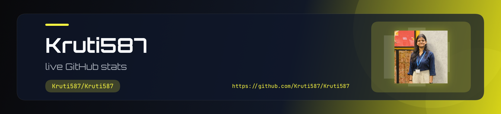
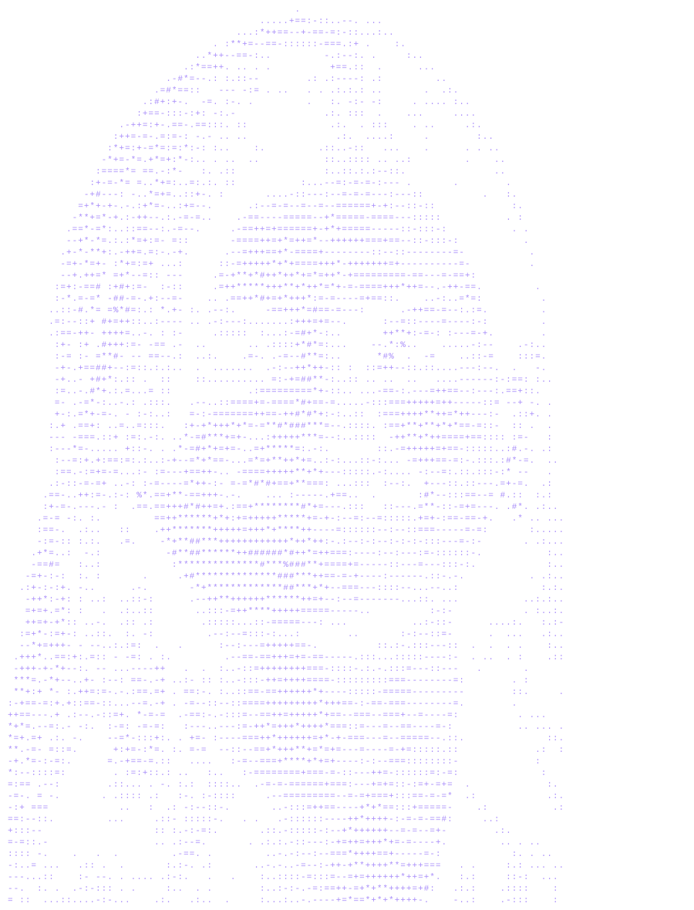

  

<h1 align="center">
  Hey there, I'm Kruti Badasheshi
</h1>

  <b>Computer Science undergraduate at BNM Institute of Technology, Bengaluru</b> 
  Open to software engineering internships · Full-stack &amp; AI projects

  

  
  
  
  
  

  
  
  

<h2 align="center">About</h2>

<table align="center">
<tr>
<td width="62%" valign="top">

I build full-stack and AI-backed products, from environmental monitoring dashboards to resume tools and applied GenAI. I care about clean systems, practical impact, and shipping work recruiters can review.

- **Role interest:** Software engineering internships — full-stack, backend, applied AI, data, or research computing
- **Currently:** CSE @ BNMIT (2024–2028) · IEEE SMCS Chair · GFG Campus Mantri · GSSoC ’26
- **Focus:** Python, C/C++, Java, AI/ML, full-stack, space & marine research tooling
- **Recent work:** WeatherIntel, coral / remote-sensing work, resume checker, Skin Twin, Samsung GenAI coursework

</td>
<td width="38%" align="center" valign="middle">

</td>
</tr>
</table>

<h2 align="center">Featured projects</h2>

| Project | What it is | Stack |
| --- | --- | --- |
| [WeatherIntel](https://github.com/Kruti587/WeatherIntel) | Environmental monitoring platform with adaptive alert thresholds from seasonal baselines and rolling averages | TypeScript, React, Express, PostgreSQL |
| [resume_checker](https://github.com/Kruti587/resume_checker) | Tooling to review and score resumes | JavaScript |
| [skin-twin](https://github.com/Kruti587/skin-twin) | Applied product work in TypeScript | TypeScript |
| [GenAI](https://github.com/Kruti587/GenAI) | Coursework from the Samsung Innovation program | Generative AI |

<h2 align="center">Tech stack</h2>

<h3 align="center">Core programming</h3>

  

<h3 align="center">AI / ML / Data science</h3>

  

<h3 align="center">Full stack / Backend</h3>

  

<h3 align="center">Databases</h3>

  

<h3 align="center">DevOps / Systems</h3>

  

  

<h3 align="center">Research / Academic</h3>

  

  
  
  
  
  

<h3 align="center">Space / Research computing</h3>

  

  
  
  
  
  
  
  
  
  

<h3 align="center">Marine / Earth / Remote sensing</h3>

  

  
  
  
  
  
  
  

<h3 align="center">Mobile / Tools</h3>

  

<h3 align="center">Design / Visualization</h3>

  

<h3 align="center">Leadership / Campus</h3>

  
  
  

<h2 align="center">Competitive programming</h2>

  
  

<h2 align="center">GitHub activity</h2>

  
  

  

  

<h2 align="center">Contribution graph</h2>

  <picture>
    <source media="(prefers-color-scheme: dark)" srcset="https://raw.githubusercontent.com/Kruti587/Kruti587/output/github-contribution-grid-snake-dark.svg" />
    
  </picture>

<h2 align="center">Contact</h2>

  Happy to talk about internships, projects, or collaborations. 
  <b>Email:</b> <a href="mailto:kranbadsh@gmail.com">kranbadsh@gmail.com</a>
  ·
  <b>LinkedIn:</b> <a href="https://www.linkedin.com/in/kruti-badasheshi-861357333">kruti-badasheshi</a>
  ·
  <b>GitHub:</b> <a href="https://github.com/Kruti587">Kruti587</a>
  ·
  <b>LeetCode:</b> <a href="https://leetcode.com/u/kruti_2403/">kruti_2403</a>
  ·
  <b>Codeforces:</b> <a href="https://codeforces.com/profile/kr19">kr19</a>

  
  
  
  
  

  

